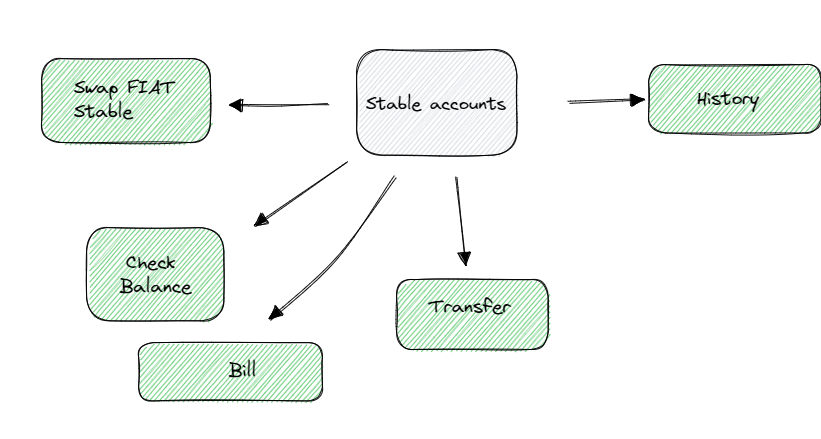

# Dataflow 

In this document, I will present the data flow for the project. The objective is to create a Stablecoin on an already established banking infrastructure that merges the functions of a bank and an asset brokerage.

This infrastructure will be the project foundation, and to demonstrate the data flows, I find it crucial to introduce the pre-existing structure utilized for executing the project.

The model below represents the structure for Pix transfers, bank ccounts, and securities brokerage, where data already flows following the existing structure.

______
The next data flow is the treasury and the treasury registry. All hoarding and de-hoarding operations occur through the acquisition or liquidation of securities via the brokerage. The records of these transactions are saved in the treasury transaction registry. Our Stablecoin can only be generated through the acquisition of underlying assets via hoarded government securities.

______

Updates to Stable account balances occur when there are operations both within and outside the Stable system. For example, when a Pix payment is received within the Stable system, generating a balance of Stablecoin in a customer's account, an update operation to the balance and a transaction history generation operation are recorded. A similar process would occur for a transaction in which a customer is performing an operation outside the Stable system, such as a Pix payment.

________

Our main frontend structure is Stable Accounts, where it's possible to access all other operations that will be performed within the system, each with a specific path.

Among the available options, the Check Balance is the simplest of all because it only displays the balance in the account or reloads the interface if the balance hasn't been updated on the screen after an operation.

Another structure that is also quite simple is the History. The History only accesses the Stable History to retrieve the account holder's transaction history.

I will explain the flow of the other three operations in more detail below.

_________

The next data flow is "Swap FIAT Stable", which is the exchange of Stablecoin for FIAT currency. This is essentially an operation that settles your Stables, and it occurs in several stages.

The first stage is "Account Verification", which verifies key information in the account such as balance to carry out the operation, for example. After all information is verified, we move on to the "Status" stage.

At the "Status" stage, two things happen. First, it checks if the operation has already been carried out at some point or if it is in progress. Second, it creates a pre-registration indicating that an operation is being carried out. Since we are dealing with a "Swap" operation, the pre-registration will have information related to a "Swap" settlement. This pre-registration, like other operations, will have an estimated deadline to be completed. If this deadline is not met, the operation is considered failed.

The "Swap" operation doesn't end here. After the pre-registration is created by the "Status" stage and sent to the "Stable Registry", the operation then moves on to another flow called "Transfer Stable to PIX Outside". Notice that the flow used for "Swap" will be the same as the one used for "PIX". In fact, both operations are very similar, with the only difference being the final destination of the FIAT money which will occur in the pre-existing bank account structure.

_______

Transactions made between Stable system accounts follow a different and much simpler path. After confirmation and generation of a status similar to Pix transactions outside of Stable, these transactions go through a path called Stable to Stable Transfer and go directly to the Update Account Balance step, where the values are transferred and the transfer operation is performed.

In all types of transfers, balance-changing operations are performed in the Update Account Balance. When transfers go outside the system, the Update Account Balance operations are not defined by demand strategies in the operational model. However, keep in mind that every transaction carried out outside the Stable system will retain the balance in Stable and issue a settlement order for that Stablecoin and possibly for the securities linked to the value of that Stablecoin. The smaller details depend heavily on the strategy to be used.
_____________

_____________________

Payments may be the least explored area in this project, essentially payment of bills is understood as transfers outside the Stable system or internally, so it ends up following the same path when it comes to payments, since billings are simply reverse orders for payments. However, for bill generation, collaboration with the pre-existing banking infrastructure is necessary to enable fiat billing. All bills that are made outside the system will automatically be converted to Stable when received, but payments received in Stable will remain in Stable.

